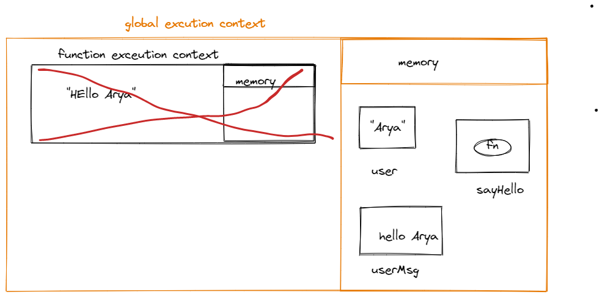
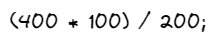
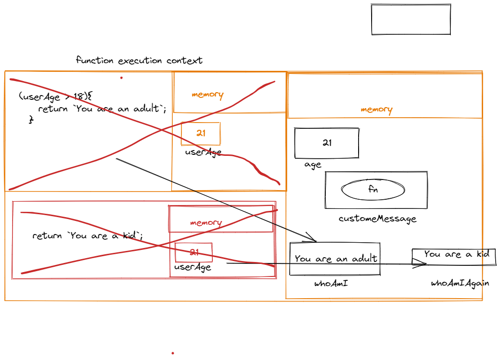

1. What does thread of execution means in JavaScript?

   - Thread of execution means Javascript engine take the code and excute the code line by line i.e also known as thread of excution and give the output.

2. Where the JavaScript code gets executed?

   - javascript code get executed in enviroment called context or Global excution context.

3. What does context means in Global Execution Context?
   - Context is an enviroment in which you are excuting the code. It is created once for ecach programming. It has two section one for excution purpose and another for memory purpose.

4. When do you create a global execution context.
   - As soon as the code is excuted, the javascript engine create a global excution context.

5. Execution context consists of what all things?
   - It consists of two section 
      a. Memory Section
      b. Excution Section or any computation excute

6. What are the different types of execution context?
  - Two types of excution context are - one get created only once through the program and another one known as function excution context that created whenever you crating any function.


7. When global and function execution context gets created?
   - global excution context get created once through the life time of program.

     Function excution context that created whenever you creating any function.


8. Function execution gets created during function execution or while declaring a function.
   - Function execution gets created during function execution

9. Create a execution context diagram of the following code on your notebook. Take a screenshot/photo and store it in the folder named `img`. Use `` to display it here.


```js
var user = "Arya";

function sayHello(){
  return `Hello ${user}`;
}

var userMsg = sayHello(user);
```

<!-- Put your image here -->





```js
var marks = 400;
var total = 500;

function getPercentage(amount, totalAmount){
  return (amount * 100) / totalAmount;
}

var percentageMarks = getPercentage(marks, total);
var percentageProfit = getPercentage(400, 200);
```

<!-- Put your image here -->




```js
var age = 21;

function customeMessage(userAge){
  if(userAge > 18){
    return `You are an adult`;
  }else {
    return `You are a kid`;
  }
}

var whoAmI = customeMessage(age);
var whoAmIAgain = customeMessage(12);
```

<!-- Put your image here -->

